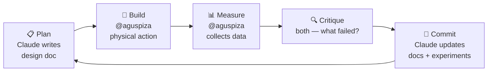

# Contributing

This is a personal engineering journal. Public so others can learn — including from the failures.

## Workflow



## File conventions

- **Experiments:** `experiments/EXP-NNN-title.md` — use TEMPLATE.md
- **Docs:** small focused files, one topic each, in `docs/<system>/`
- **Every doc:** acronym table at top, Mermaid diagrams for flows, change log at bottom
- **Results are append-only** — don't silently edit conclusions; open a FINDING issue

## Experiment ID ranges

| Range | System |
|---|---|
| EXP-001–009 | Water |
| EXP-010–019 | Energy |
| EXP-020–029 | Food |
| EXP-030–039 | Automation |

## Commit format

```
[system] short imperative description

Optional explanation.

Refs: EXP-020, #12
```

System tags: `water` `energy` `food` `automation` `integration` `docs`

## Issues

- **🧪 New Experiment** — before starting any trial
- **🔍 Finding / Critique** — after results or when a design flaw is found
