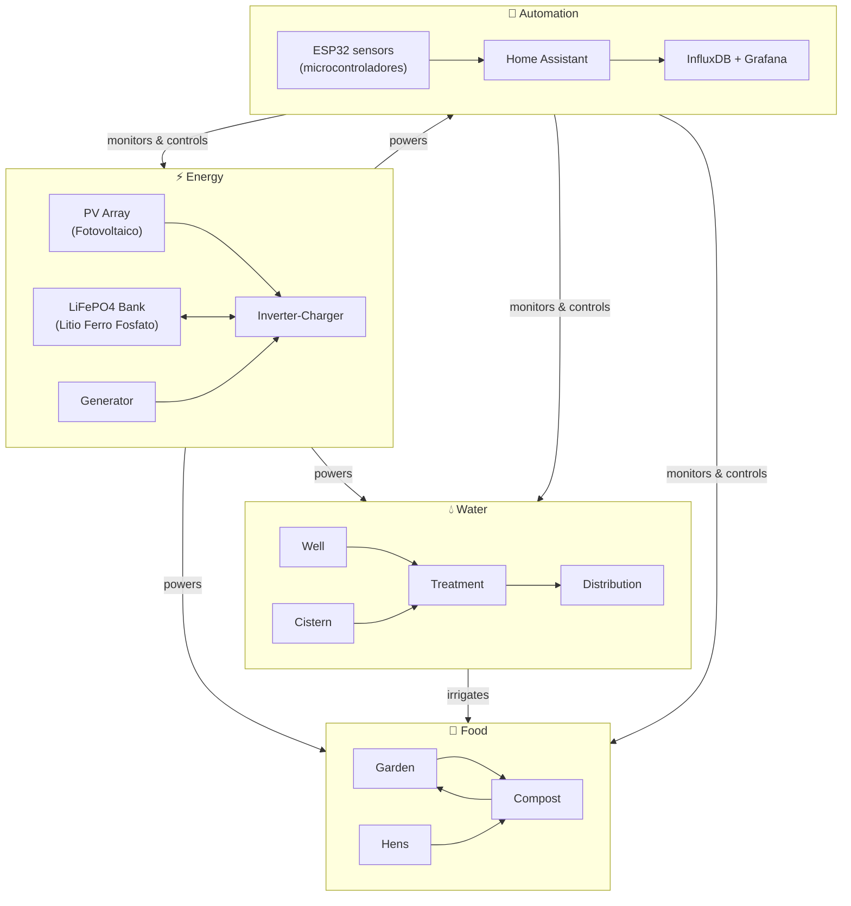
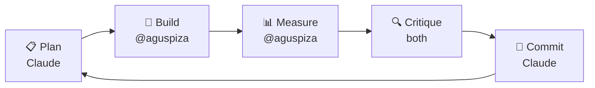
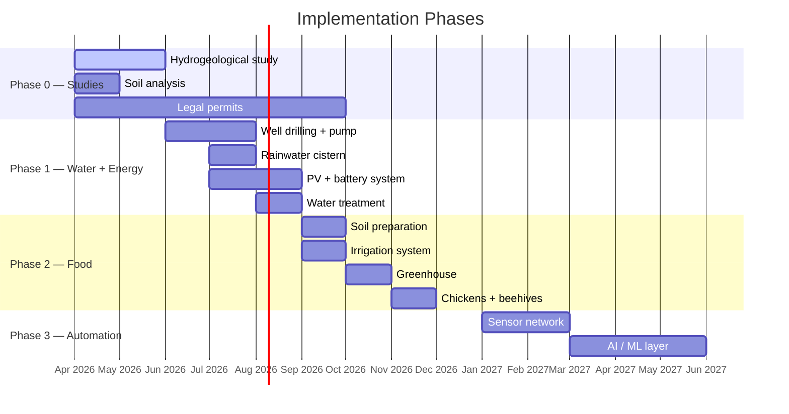

# 🌱 Self-Sustained

**An iterative engineering journal toward 70–80% autonomy in water, energy, and food.**

> *"What can't be measured can't be optimized."*

---

## Context

| Parameter | Value |
|---|---|
| Location | Rural Mediterranean, Spain |
| Starting point | Clean land, no existing infrastructure |
| Target autonomy | 70–80% across water, energy, and food |
| Budget | 30k–100k € phased over ~24 months |
| Approach | Iterative — plan → build → measure → critique → improve |

---

## Division of labor

| Layer | Who |
|---|---|
| Physical world (construction, experiments, measurements) | [@aguspiza](https://github.com/aguspiza) |
| Digital world (docs, code, automation, data analysis, AI) | Claude (Anthropic) |

---

## System map

---

## Iteration loop

---

## Documentation index

| System | Index |
|---|---|
| 💧 Water | [docs/water/](docs/water/README.md) |
| ⚡ Energy | [docs/energy/](docs/energy/README.md) |
| 🌿 Food | [docs/food/](docs/food/README.md) |
| 🤖 Automation | [docs/automation/](docs/automation/README.md) |
| 🔗 Integration | [docs/integration/](docs/integration/README.md) |
| 🔒 Security | [docs/security/](docs/security/README.md) |

---

## Phase roadmap

---

## Autonomy tracker

| Resource | Target | Current |
|---|---|---|
| 💧 Water | 80% | 0% |
| ⚡ Energy | 75% | 0% |
| 🌿 Food | 65% | 0% |
| **Overall** | **73%** | **0%** |

---

## Budget summary

| Phase | Investment | Autonomy gained |
|---|---|---|
| Phase 0 — Studies, permits & security | 6,000–11,000 € | — |
| Phase 1 — Water + Energy | 28,000–46,000 € | ~65% |
| Phase 2 — Food | 6,000–14,000 € | +10–15% |
| Phase 3 — Automation | 1,500–5,000 € | +5% |
| **Total** | **41,500–76,000 €** | **~75–80%** |

---

## License

[CC BY-SA 4.0](LICENSE)
