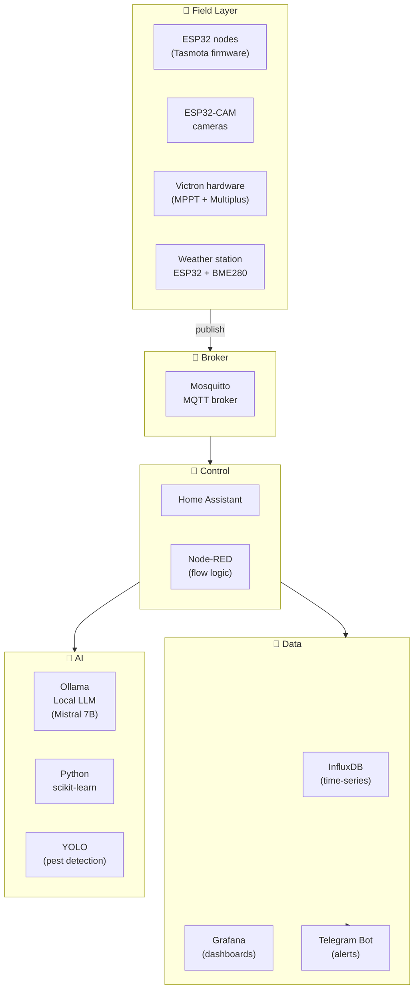

# 🤖 Automation & AI Stack

## Core principle

> Every physical system must be **manually operable first**.
> Automation optimises and alerts — a software failure must never break basic farm function.

## Full architecture

## Subsections

| Document | Contents |
|---|---|
| [hardware.md](hardware.md) | Server, ESP32 nodes, sensors, cameras |
| [software.md](software.md) | Full software stack, Docker setup |
| [levels.md](levels.md) | Automation levels 1–3 with flowcharts |
| [remote-access.md](remote-access.md) | Tailscale VPN, backup policy |

## Acronyms

| Acronym | Full name | Spanish |
|---|---|---|
| IoT | Internet of Things | Internet de las Cosas |
| MQTT | Message Queuing Telemetry Transport | Protocolo pub/sub ligero para sensores IoT |
| ESP32 | — | Microcontrolador WiFi/BT de Espressif |
| GPIO | General Purpose Input/Output | Pines multipropósito del microcontrolador |
| LLM | Large Language Model | Modelo de lenguaje grande |
| VPN | Virtual Private Network | Red privada virtual |
| OTA | Over-The-Air | Actualización remota del firmware |

## Change log

| Date | Change | Author |
|---|---|---|
| 2026-04-15 | Initial draft | Claude |
