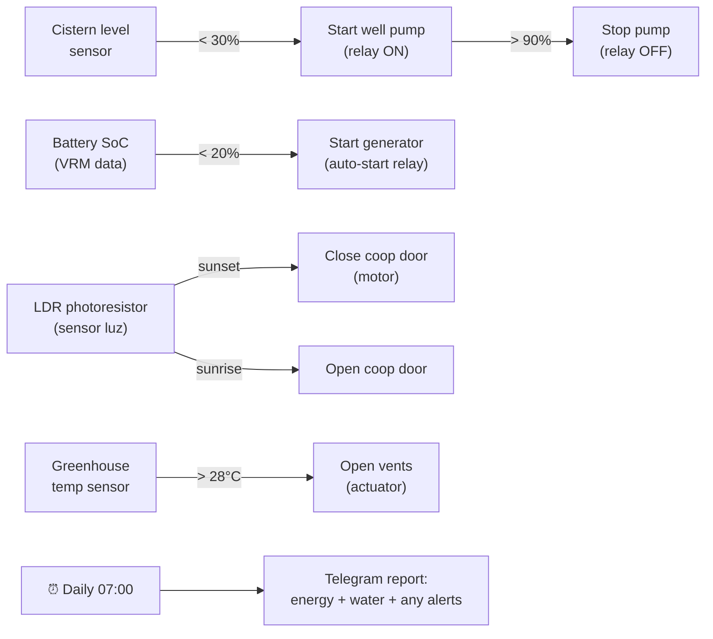
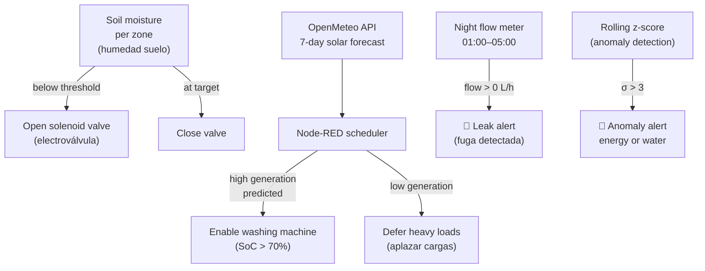
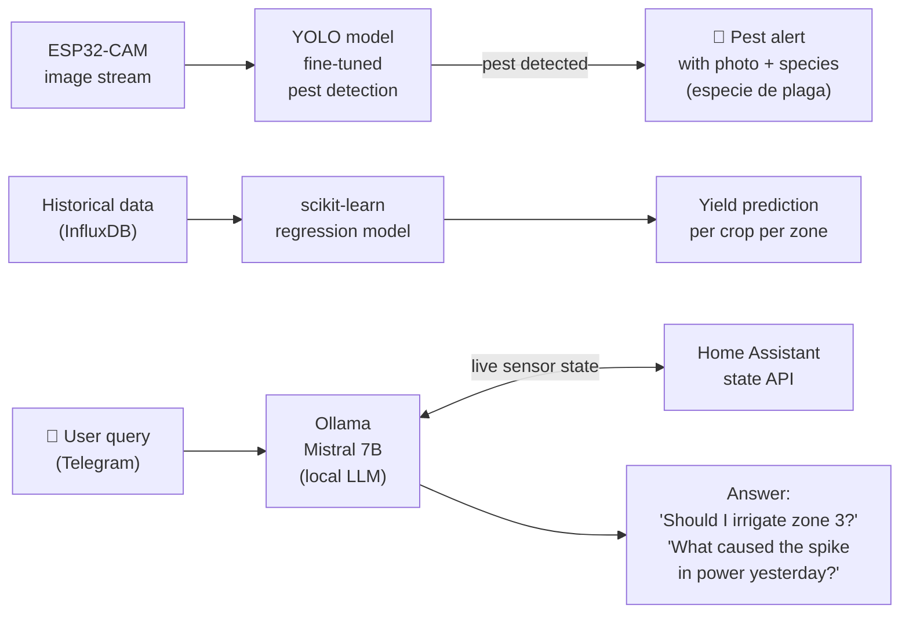

# Automation Levels

Three progressive levels. Each level assumes the previous one is stable.

## Level 1 — Basic control (months 1–6)

## Level 2 — Optimization (months 6–18)

## Level 3 — AI-assisted (months 18+)

## Change log

| Date | Change | Author |
|---|---|---|
| 2026-04-15 | Initial draft | Claude |
