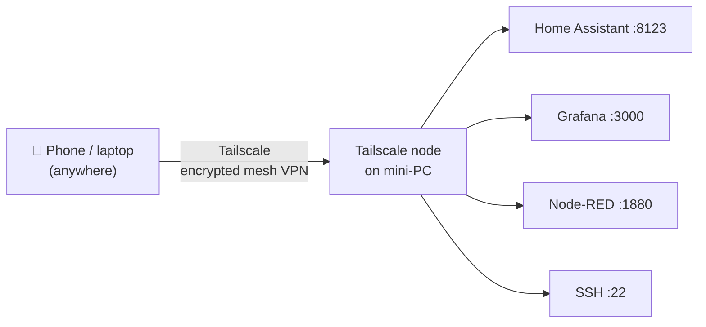

# Remote Access & Backup

## Remote access via Tailscale

**Why Tailscale?**
- No open ports on the router (no port forwarding needed)
- No dynamic DNS setup
- Works through CGNAT (carrier-grade NAT, common with rural 4G connections)
- Free tier supports up to 100 devices

## Backup policy

| Data | Target | Frequency | Method |
|---|---|---|---|
| Home Assistant config | This GitHub repo | On every change | `git push` |
| Node-RED flows | This GitHub repo | On every change | Export JSON + `git push` |
| InfluxDB data | External HDD (local) | Weekly | `influx backup` cron job |
| Full system snapshot | External HDD (local) | Monthly | `rsync` |

## Change log

| Date | Change | Author |
|---|---|---|
| 2026-04-15 | Initial draft | Claude |
