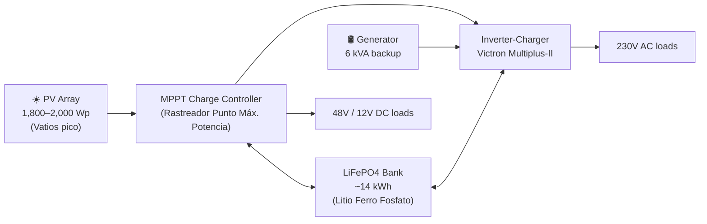

# ⚡ Energy System

## Overview

Off-grid (or hybrid) photovoltaic system with lithium battery storage and diesel generator backup.

## Subsections

| Document | Contents |
|---|---|
| [sizing.md](sizing.md) | Load audit, PV and battery sizing formulas |
| [components.md](components.md) | Component selection, comparison tables |
| [control.md](control.md) | Victron stack, generator logic, Node-RED flows |
| [regulations.md](regulations.md) | REBT, ITC-BT-40, RD 244/2019 |

## Design targets

| Parameter | Value |
|---|---|
| Daily design consumption | 5 kWh/day |
| PV installed | 1,800–2,000 Wp |
| Battery capacity (usable) | ~14 kWh |
| Battery autonomy (no sun) | 2.5 days |
| Generator use target | < 200 h/year |
| Grid independence | > 75% of annual hours |

## Acronyms

| Acronym | Full name | Spanish |
|---|---|---|
| PV | Photovoltaic | Fotovoltaico |
| Wp | Watt-peak | Vatio pico |
| PSH | Peak Sun Hours | Horas de sol pico |
| DoD | Depth of Discharge | Profundidad de descarga |
| SoC | State of Charge | Estado de carga |
| SoH | State of Health | Estado de salud de la batería |
| LiFePO4 | Lithium Iron Phosphate | Litio Ferro Fosfato |
| BMS | Battery Management System | Sistema de gestión de baterías |
| MPPT | Maximum Power Point Tracker | Rastreador del punto de máxima potencia |
| REBT | Reglamento Electrotécnico de Baja Tensión | Spanish low-voltage electrical code |
| VRM | Victron Remote Management | Portal de monitorización Victron |

## Change log

| Date | Change | Author |
|---|---|---|
| 2026-04-15 | Initial draft | Claude |
