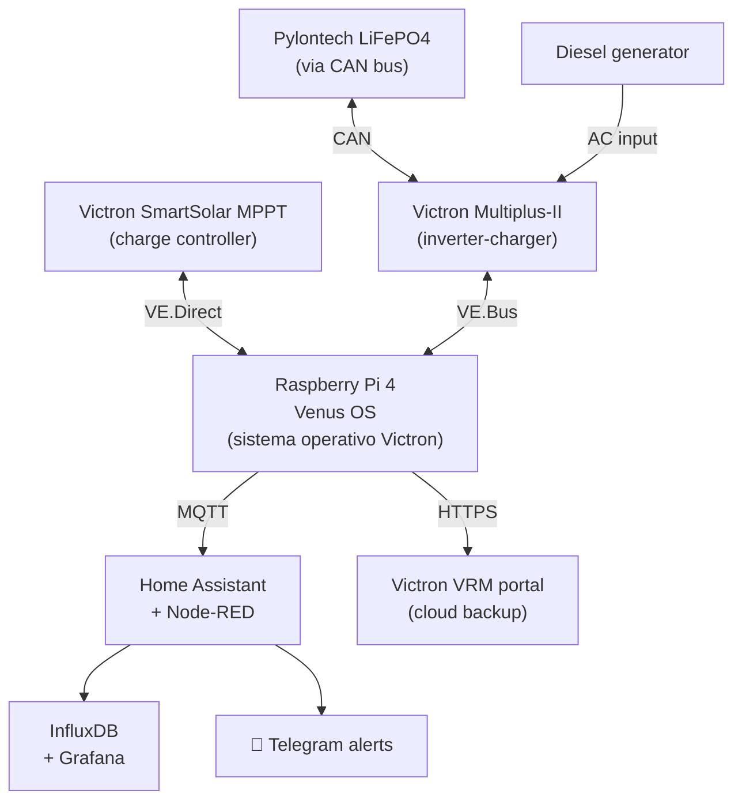
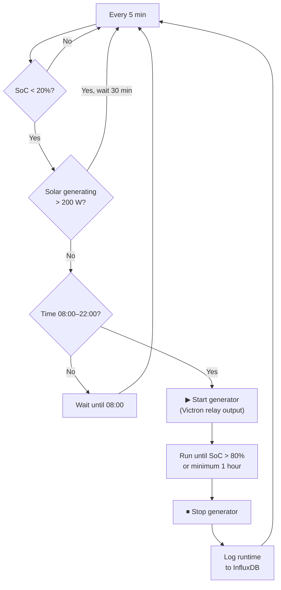

# Energy Control & Monitoring

## Victron stack architecture

## Generator auto-start logic

## Load shedding rules (Node-RED)

| Condition | Action |
|---|---|
| SoC < 40% | Disable washing machine relay |
| SoC < 25% | Disable water pump AC relay |
| SoC < 20% | Start generator (see above) |
| Solar forecast > 8 kWh tomorrow | Schedule washing machine for 10:00–14:00 |

## Key metrics to monitor

| Metric | Source | Alert threshold |
|---|---|---|
| Battery SoC | SmartShunt | < 20% |
| Battery SoH | BMS cycle count | < 80% |
| Daily PV yield | MPPT telemetry | < 1 kWh/day (3 days running) |
| Generator runtime | Hour counter | > 20 h/month |
| DC bus voltage | Victron | Outside 46–58 V |

## Change log

| Date | Change | Author |
|---|---|---|
| 2026-04-15 | Initial draft | Claude |
