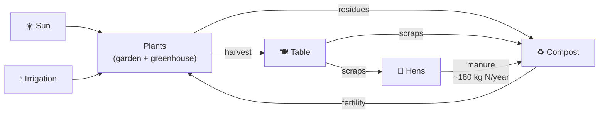

# 🌿 Food System

## Overview

## Design goals

- Cover ~60–70% of caloric needs and 80–90% of vitamins/minerals
- Primary on-site protein: eggs
- Zero synthetic pesticides (IPM — Integrated Pest Management / Manejo Integrado de Plagas)

## Subsections

| Document | Contents |
|---|---|
| [zones.md](zones.md) | Zoning, layout, crop selection |
| [calendar.md](calendar.md) | Monthly planting calendar |
| [irrigation.md](irrigation.md) | Drip system, soil moisture, scheduling |
| [greenhouse.md](greenhouse.md) | Structure, ventilation, winter production |
| [animals.md](animals.md) | Laying hens, beehives |
| [soil.md](soil.md) | Amendments, compost, rotation, analysis |

## Acronyms

| Acronym | Full name | Spanish |
|---|---|---|
| IPM | Integrated Pest Management | Manejo Integrado de Plagas |
| OM | Organic Matter | Materia orgánica |
| EC | Electrical Conductivity | Conductividad eléctrica (salinity proxy) |
| NPK | Nitrogen, Phosphorus, Potassium | Nitrógeno, Fósforo, Potasio |
| ET₀ | Reference Evapotranspiration | Evapotranspiración de referencia |
| CRA | — | Capacidad de Retención de Agua (soil water holding capacity) |

## Change log

| Date | Change | Author |
|---|---|---|
| 2026-04-15 | Initial draft | Claude |
