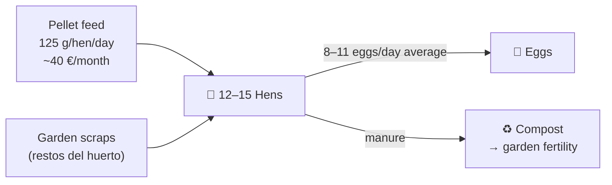

# Animals

## Laying hens (gallinas ponedoras)

| Parameter | Value |
|---|---|
| Flock size | 12–15 hens |
| Breeds | Leghorn (production), Sussex or Prat (hardy, heat-tolerant) |
| Average egg yield | 8–11 eggs/day (accounting for moult and winter dip) |
| Feed | 125 g/hen/day pellets + garden scraps |
| Monthly feed cost | ~40 € |
| Annual nitrogen from manure | ~180 kg N |
| Coop indoor space | 1 m²/hen minimum |
| Outdoor run | 4 m²/hen minimum |

## Beehives (colmenas) — recommended

| Parameter | Value |
|---|---|
| Hives | 2–4 Langstroth |
| Primary value | **Pollination** → +20–30% fruit and vegetable yield |
| Secondary value | Honey: 15–40 kg/hive/year (Mediterranean flora) |
| Setup cost | 150–300 €/hive; 50–150 € intro course |
| Regulatory | Register hives with regional agricultural authority (obligatorio en España) |

## Change log

| Date | Change | Author |
|---|---|---|
| 2026-04-15 | Initial draft | Claude |
