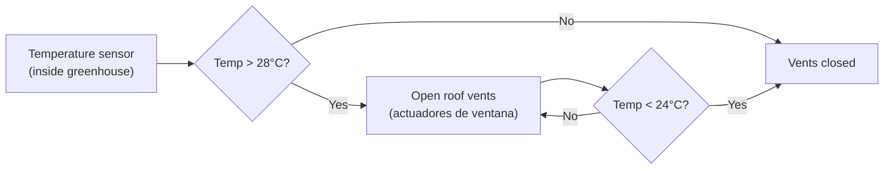

# Greenhouse (Invernadero)

## Purpose

Extends productive season by 3–4 months (October–February) in Mediterranean climate.
Protects against hail, heavy rain, and flying insects.

## Specifications

| Parameter | Value |
|---|---|
| Size | 40–50 m² |
| Type | Gothic arch tunnel (túnel gótico) |
| Cover | Twin-wall polycarbonate 8 mm (policarbonato doble pared) |
| Frame | Hot-dip galvanised steel (acero galvanizado en caliente) |
| Ventilation | Passive thermostat actuators + manual side vents |
| Heating | Passive thermal mass (water-filled containers) |
| Cost estimate | 1,500–3,500 € |

## Ventilation logic

## Winter crops (October–February)

Lettuce, spinach, chard, rocket, radishes, kale, parsley, coriander.
Tomatoes and peppers possible with supplemental heat (not planned initially).

## Change log

| Date | Change | Author |
|---|---|---|
| 2026-04-15 | Initial draft | Claude |
