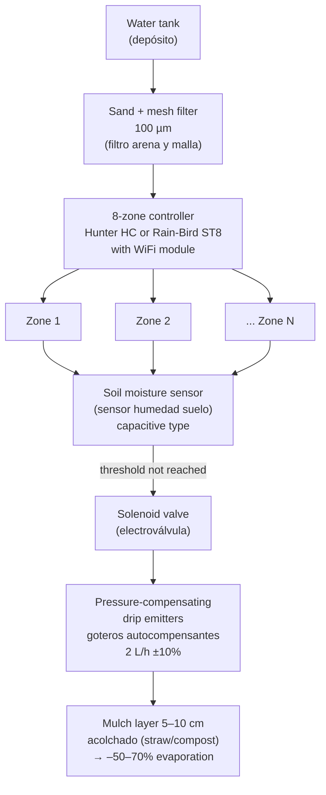

# Irrigation System

## Design

## Efficiency comparison

| Method | Efficiency | Notes |
|---|---|---|
| Drip irrigation (riego por goteo) | 85–95% | **Recommended** |
| Micro-sprinklers | 70–80% | OK for densely planted zones |
| Overhead sprinklers | 40–60% | High evaporation, promotes fungal disease |
| Furrow / flood | 30–50% | Only for zone 3 large crops, never in summer |

## Water demand estimates

| Zone | Season | L/day |
|---|---|---|
| Zone 1 (20 m²) | Summer | 40–80 |
| Zone 2 (200 m²) | Summer | 300–500 |
| Zone 3 (280 m²) | Summer | 400–700 |
| Greenhouse (40 m²) | Summer | 50–100 |
| Animals | Year-round | 10–20 |
| **Peak total** | **Summer** | **~1,400 L/day** |

## Change log

| Date | Change | Author |
|---|---|---|
| 2026-04-15 | Initial draft | Claude |
