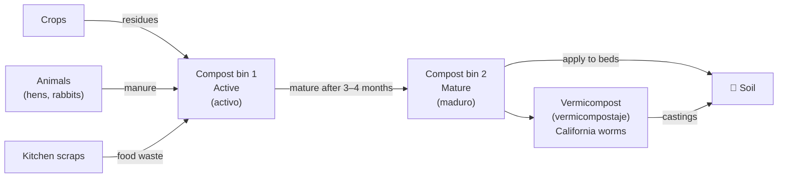

# Soil Management

## Fertility loop

## Composting targets

| Parameter | Target | Notes |
|---|---|---|
| Internal temperature | 55–65°C | Kills pathogens (higienización) and weed seeds |
| C:N ratio input | 25–30:1 | Mix brown (carbon) + green (nitrogen) materials |
| Moisture | 50–60% | Squeeze test: a few drops, no stream |
| Turn frequency | Every 2 weeks | Introduces oxygen, speeds decomposition |
| Time to maturity | 3–4 months | Smells earthy, no recognisable inputs |

## Soil analysis schedule

| Frequency | Parameters | Cost |
|---|---|---|
| Annual (baseline year) | Full: pH, EC, OM%, NPK, micronutrients, CaCO₃, CEC, texture | 150–350 € |
| Annual (maintenance) | pH, EC, OM%, NPK | 80–150 € |
| After amendment | pH, EC | 30–60 € |

> **CaCO₃** (calcium carbonate / carbonato cálcico): high in Mediterranean calcareous soils.
> Above 20% active lime → locks up iron and zinc → treat with chelated micronutrients.

## Amendment strategy (pending soil results)

| Finding | Amendment |
|---|---|
| pH > 8.0 | Elemental sulphur (azufre elemental) + acidifying fertilisers |
| OM < 1% | 10–15 t/ha compost before first season |
| Fe / Zn deficiency | Chelated iron EDDHSA foliar spray |
| EC > 1.5 dS/m | Investigate water source; add gypsum (yeso) to improve Na/Ca ratio |

## Change log

| Date | Change | Author |
|---|---|---|
| 2026-04-15 | Initial draft | Claude |
