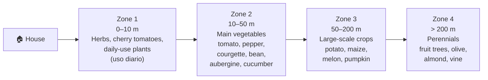
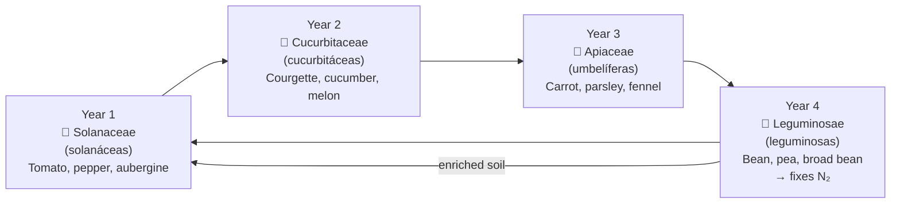

# Garden Zones

## Zoning layout

**Total initial cultivated area:** ~500 m² (zones 1–3)

## Zone details

| Zone | Distance | Area (est.) | Irrigation | Effort |
|---|---|---|---|---|
| 1 — Daily herbs & salads | 0–10 m | 20 m² | Drip or hand | High (daily attention) |
| 2 — Main vegetables | 10–50 m | 200 m² | 8-zone drip | Medium |
| 3 — Large-scale crops | 50–200 m | 280 m² | Drip + furrow | Low |
| 4 — Perennials | > 200 m | TBD | Drip until established | Very low after year 3 |

## Crop rotation (4-year cycle)

## Change log

| Date | Change | Author |
|---|---|---|
| 2026-04-15 | Initial draft | Claude |
