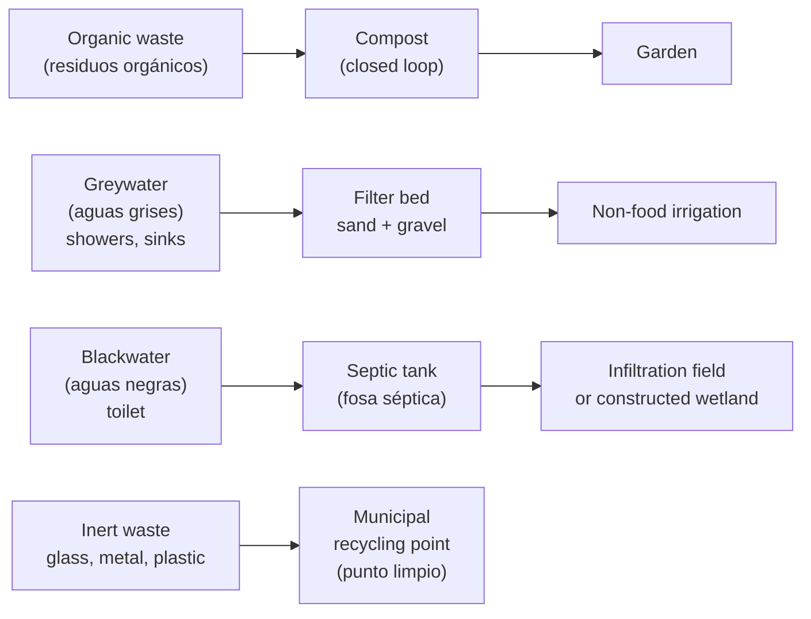

# 🔗 Integration

Cross-system infrastructure shared between water, energy, and food subsystems.

## Structures

| Structure | Function | Area | Cost estimate |
|---|---|---|---|
| Technical room (cuarto técnico) | Batteries, inverters, switchboards, water filters, server | 12–20 m² | 6,000–15,000 € (construction) |
| Storage / workshop (almacén) | Tools, spares, seeds, inputs | 20–40 m² | 3,000–8,000 € |
| Animal housing | Coop + run + feed storage | 15–25 m² | 1,500–4,000 € |
| Greenhouse | Winter production + nursery | 40–50 m² | 1,500–5,000 € |

## Waste management

## Resilience matrix

| Failure scenario | Impact | Contingency |
|---|---|---|
| Well pump failure | No groundwater | Cistern buffer (10+ days). Emergency 12V pump. |
| Inverter failure | No AC electricity | Generator direct. DC loads on 12V bus. |
| Prolonged drought | Low aquifer level | Restrict irrigation. Human water priority. Municipal backup. |
| Crop failure (pest, frost) | Lost production | 3-month dry food reserve. Local market. Seed bank. |
| Server / automation failure | No automation | All systems operable manually by design. |

## Minimum stock reserves

| Item | Quantity | Rationale |
|---|---|---|
| Bottled water | 200 L | 10 days for 2 people without any system |
| Dry food (rice, legumes, oil) | 3-month supply | Covers total crop failure |
| Fuel (gasoil) | 200 L in certified tank | ~100 generator hours |
| Filter cartridges | 6× per stage | 1 year of replacements |
| RO membrane | 1 spare | 2–3 year replacement cycle |
| UV lamp | 1 spare | Annual replacement |
| ESP32 boards | 5× | Node failure replacement |
| Fuses + MCBs | Assorted set | Electrical fault |

## Change log

| Date | Change | Author |
|---|---|---|
| 2026-04-15 | Initial draft | Claude |
