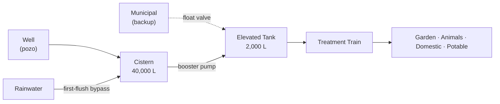

# 💧 Water System

## Overview

| Source | Role | Status |
|---|---|---|
| Rainwater cistern (cisterna pluvial) | Primary — garden, animals, cleaning | Phase 1 |
| Groundwater well (pozo) | Secondary — permitting 6–18 months, uncertain | Phase 1+ |
| Municipal supply (red municipal) | Emergency backup only | Passive |

## Subsections

| Document | Contents |
|---|---|
| [well.md](well.md) | Drilling, pump, legal permits |
| [rainwater.md](rainwater.md) | Catchment, first-flush, cistern |
| [treatment.md](treatment.md) | Filtration, RO, UV, quality testing |
| [distribution.md](distribution.md) | Pipework, pressure, monitoring |

## Design targets

| Parameter | Value |
|---|---|
| Daily consumption | 800–1,200 L/day |
| Peak summer demand | up to 1,800 L/day |
| Storage buffer | ≥ 10 days → 18,000 L minimum |
| Potable quality | WHO drinking water guidelines |

## Acronyms

| Acronym | Full name | Spanish |
|---|---|---|
| RO | Reverse Osmosis | Ósmosis inversa |
| UV | Ultraviolet germicidal lamp | Ultravioleta |
| EC | Electrical Conductivity | Conductividad eléctrica |
| PEAD | Polietileno de Alta Densidad | HDPE pipe |
| CHJ / CHS | Confederación Hidrográfica del Júcar / Segura | River basin authority |
| IGME | Instituto Geológico y Minero de España | Spanish geological survey |

## Change log

| Date | Change | Author |
|---|---|---|
| 2026-04-15 | Initial draft | Claude |
