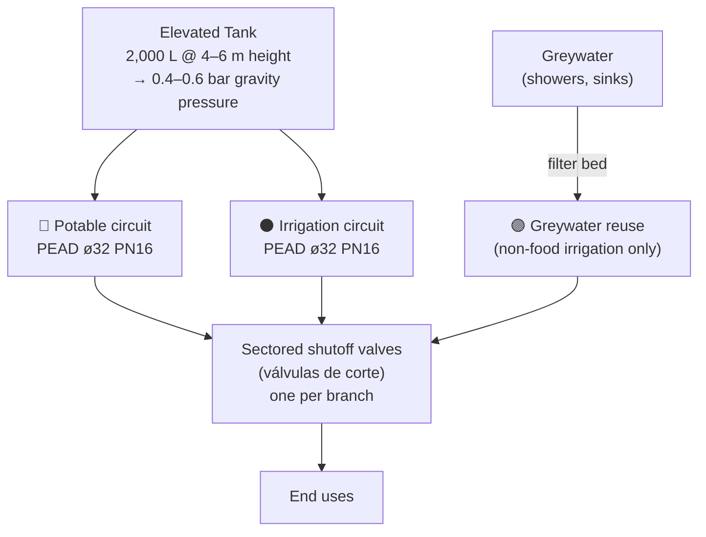
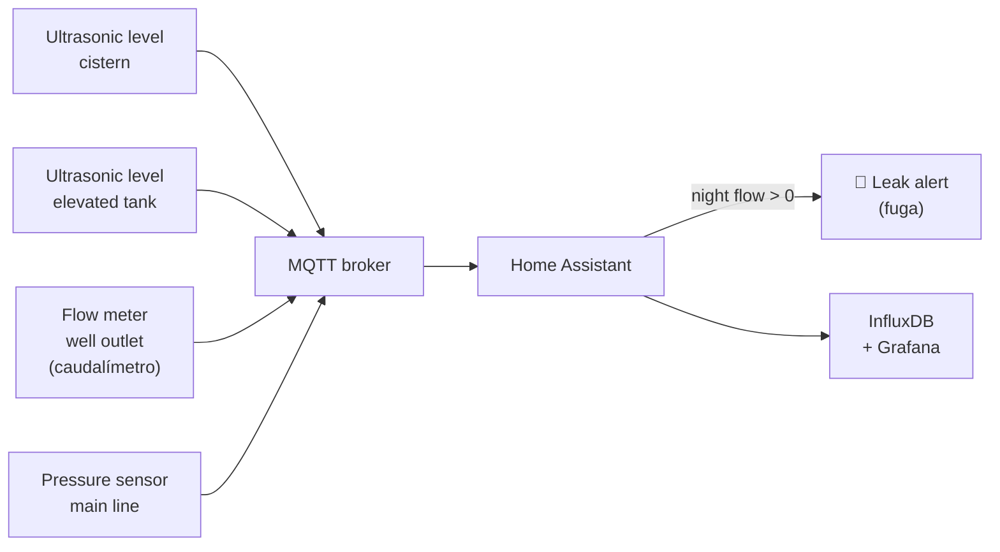

# Water Distribution

## Circuit layout

**Color coding (standard):** potable = blue, irrigation = black, greywater = purple.
Never cross-connect circuits.

## Pipe specification

| Parameter | Value |
|---|---|
| Material | PEAD (HDPE — High-Density Polyethylene) |
| Diameter | ø32 mm main runs; ø25 mm branches; ø16 mm drip laterals |
| Pressure rating | PN16 (nominal 16 bar — way above operating pressure, for longevity) |
| Joints | Compression fittings or electrofusion (electrofusión) — no solvent cement outdoors |
| Working pressure | 1.0–1.5 bar at point of use |

## Pressure options

| Option | Pressure | Cost | Notes |
|---|---|---|---|
| Elevated tank 4 m | ~0.4 bar | Low | Free pressure, no electricity needed |
| Elevated tank 6 m | ~0.6 bar | Low | Enough for showers and drip |
| Hydrophore (pressure tank) | 1.5–3 bar | Medium | Small pump + pressure vessel; needs electricity |
| DC pressure pump 12V | 1.5–2 bar | Medium | Works directly from battery bus |

## Monitoring

| Alert condition | Meaning |
|---|---|
| Flow > 0 between 01:00–05:00 | Probable leak (fuga) |
| Cistern level < 20% | Low reserve — restrict irrigation |
| Elevated tank level < 30% | Booster pump fault or high demand |
| Pressure drop > 0.3 bar overnight | Leak in pressurised circuit |

## Change log

| Date | Change | Author |
|---|---|---|
| 2026-04-15 | Initial draft | Claude |
