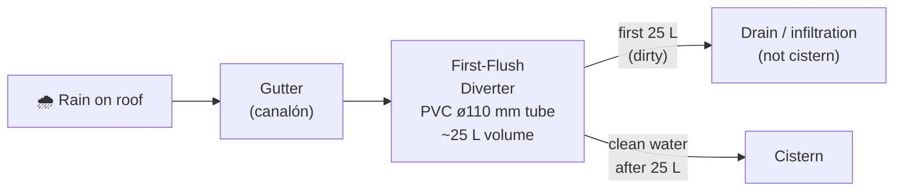

# Rainwater Harvesting (Captación Pluvial)

## Sizing

**Formula:**
```
Capturable (L/year) = Rainfall (mm/year) × Catchment area (m²) × Runoff coefficient
```

| Variable | Value | Notes |
|---|---|---|
| Annual rainfall | 450–550 mm | Mediterranean Spain estimate |
| Roof area (estimate) | 100 m² | Confirmed once building is designed |
| Runoff coefficient | 0.80 | Ceramic tile (teja cerámica) |
| **Capturable/year** | **36,000–44,000 L** | ~100–120 L/day average |

> This does **not** replace the well. It reduces pumping load by ~10–15% and provides a buffer during pump maintenance.

## First-flush diverter (desviador de primer flujo)

The first ~25 L of each rain event carries rooftop dust, bird droppings, and debris.
This must be discarded before water enters the cistern.



**DIY first-flush diverter:** a vertical PVC tube ø110 mm with a slow-drain ball at the bottom.
It fills with dirty water first, then clean water overflows to the cistern. Cost: 50–150 €.

## Cistern

| Parameter | Value |
|---|---|
| Volume | 40,000 L |
| Type | Precast reinforced concrete, buried (hormigón prefabricado enterrado) |
| Overflow | Diverted to infiltration zone to recharge aquifer |
| Inlet filter | Mesh 1 mm to exclude leaves and insects |
| Access | Manhole cover, lockable |
| Cost (installed) | 3,000–6,000 € |

## Change log

| Date | Change | Author |
|---|---|---|
| 2026-04-15 | Initial draft | Claude |
