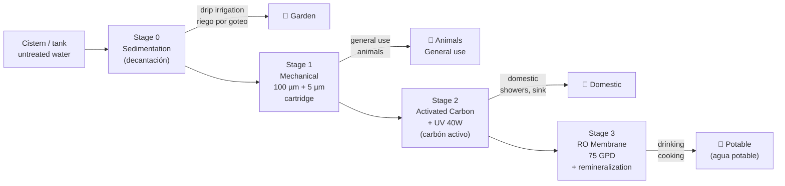

# Water Treatment Train

## Overview

Four treatment stages in series. Each stage adds cost and maintenance.
Use only the stages required for the intended end use.

## Stage details

| Stage | Technology | Removes | Maintenance | Cost |
|---|---|---|---|---|
| 0 | Settling tank + coarse mesh | Sediment, insects | Monthly mesh clean | < 100 € |
| 1 | 100 µm pre-filter + 5 µm cartridge filter | Fine particles, turbidity | Replace cartridge every 3–6 months | 200–500 € |
| 2 | Activated carbon block + UV 40W lamp | Chlorine, organics, bacteria, viruses | Replace carbon 6–12 months; replace UV bulb annually | 400–900 € |
| 3 | RO membrane 75 GPD + remineralization | Dissolved salts, heavy metals, nitrates | Replace membrane every 2–3 years; replace pre-filters | 300–800 € |

> **RO (Reverse Osmosis / Ósmosis Inversa):** forces water through a semi-permeable membrane at pressure.
> Removes 95–99% of dissolved solids. Produces reject water (~50% of input) that can be diverted to garden.

## Water quality testing

Test potable water at a certified laboratory at least **once per year**.

| Parameter | Why | Limit (WHO) |
|---|---|---|
| E. coli | Fecal contamination | 0 CFU/100 mL |
| Nitrates (nitratos) | Agricultural runoff | < 50 mg/L |
| Heavy metals (metales pesados) | Geological or pipe origin | Varies by metal |
| pH | Treatment efficiency, pipe corrosion | 6.5–8.5 |
| Hardness (dureza) | Scale in pipes and appliances | < 200 mg/L CaCO₃ |
| EC (conductividad eléctrica) | Total dissolved solids proxy | < 1.5 dS/m |

Recommended labs: IMIDRA (Madrid), IRTA (Catalonia), local cooperative lab. Cost: 100–250 €.

## Change log

| Date | Change | Author |
|---|---|---|
| 2026-04-15 | Initial draft | Claude |
