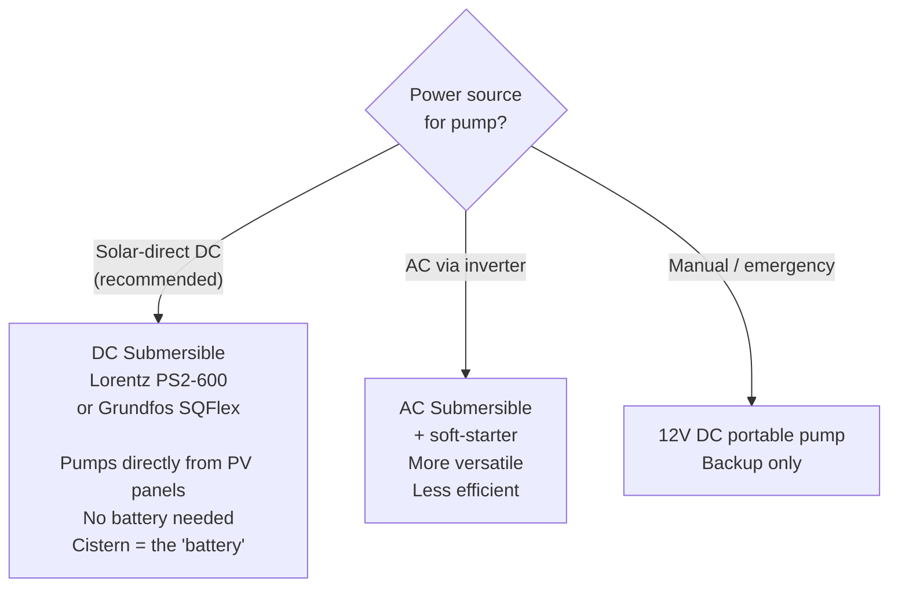

# Well (Pozo)

## Legal requirements (Spain)

Groundwater is **public hydraulic domain** (dominio público hidráulico) under RDLeg 1/2001.
Any well requires a **concession** (concesión) from the relevant basin authority — CHJ, CHS, etc.

> ⏱️ Start the concession process immediately. Typical timeline: **6–18 months**.

Steps:
1. Obtain IGME aquifer maps for the area → [igme.es](https://igme.es)
2. Commission a hydrogeological study (estudio hidrogeológico)
3. Submit concession application to CHJ/CHS with study attached
4. Wait for approval before drilling

Rainwater harvesting requires **no concession** in most autonomous communities.

## Hydrogeological study

| Item | Detail |
|---|---|
| Method | Georadar or 2D electrical tomography (tomografía eléctrica 2D) |
| Cost | 800–2,000 € |
| Duration | 2–4 weeks |
| Output | Estimated aquifer depth, yield, water quality risk |

## Drilling & casing

| Parameter | Value |
|---|---|
| Target depth | 60–80 m (Mediterranean typical) |
| Casing | PVC ø160 mm minimum, gravel pack in aquifer zone |
| Cost | 25–60 €/m → 60 m ≈ 3,000–5,000 € |
| Total budget (drill + pump + legal) | 7,000–12,000 € |

## Pump selection

**Why solar-direct DC?**
The pump draws more current when there is more sun — which coincides with peak irrigation demand in summer.
The cistern stores the water instead of a battery storing electricity. Simpler, cheaper, longer-lived.

| Model | Max flow | Max head | Power | Price (est.) |
|---|---|---|---|---|
| Lorentz PS2-600 HR-07 | 4,200 L/h | 70 m | 600 W | 1,800–2,500 € |
| Grundfos SQFlex 5A-23 | 3,600 L/h | 60 m | 300 W | 1,500–2,200 € |

## Monitoring

| Sensor | Purpose | Alert |
|---|---|---|
| Piezometric probe (sonda piezométrica 4–20 mA) | Track water table depth | Drops > 5 m from baseline |
| Flow meter on outlet (caudalímetro magnético) | Log daily extraction | Flow < threshold when pump ON = dry run |
| Hour counter | Track runtime | > 8 h/day sustained |

## Open actions

- [ ] Download IGME maps for the specific parcel
- [ ] Commission hydrogeological study
- [ ] Submit concession application to CHJ/CHS
- [ ] Get 3 drilling quotes from local companies

## Change log

| Date | Change | Author |
|---|---|---|
| 2026-04-15 | Initial draft | Claude |
