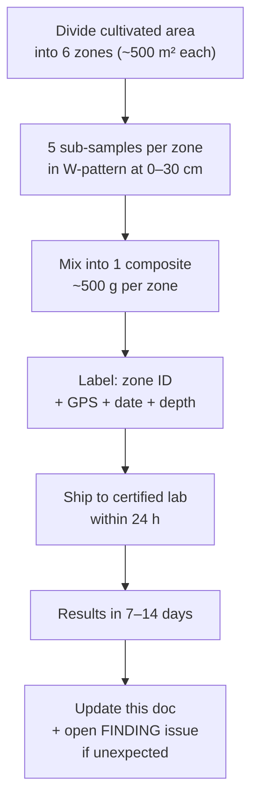
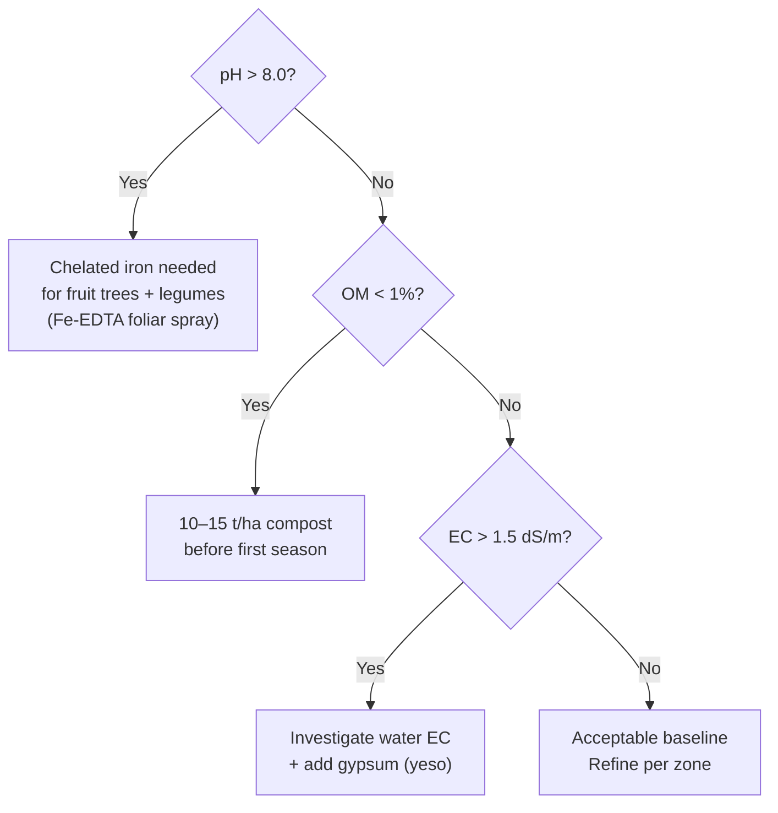

# EXP-020 — Soil Baseline Analysis

**ID:** EXP-020
**Date started:** TBD
**System:** `food`
**Phase:** `0`
**Status:** `planning`

---

## Hypothesis

Typical calcareous Mediterranean soil:
pH 7.5–8.5, organic matter (OM) < 1.5%, probable iron/zinc deficiency due to high CaCO₃
(calcium carbonate / carbonato cálcico).

---

## Setup

**Materials:**
- Soil auger / probe (barrena de suelo), 0–30 cm depth
- 6 labelled sample bags + GPS for coordinates
- Cooler bag for transport if > 2 h to lab

**Sampling plan:**

**Parameters to request:**

| Parameter | Why it matters |
|---|---|
| pH (water + KCl) | KCl method reveals buffered acidity |
| EC (conductividad eléctrica) | Salinity — > 1.5 dS/m causes crop stress |
| OM % | < 1% = poor structure; target > 2% |
| Texture: sand / silt / clay | Determines drainage and water retention (CRA) |
| P — Olsen method | Correct for alkaline/calcareous soils |
| K exchangeable | Potassium availability |
| Fe, Zn, Mn, B, Cu | Often deficient in high-pH Mediterranean soils |
| CaCO₃ % | > 20% active lime → phosphorus and micronutrient lockout |
| CEC | Cation Exchange Capacity — nutrient holding capacity |

Recommended labs: IMIDRA (Madrid), IRTA (Catalonia), local cooperative.
Cost estimate: 150–350 € for full panel × 6 samples.

---

## Raw data

| Zone | GPS | pH (H₂O) | pH (KCl) | OM % | CaCO₃ % | P mg/kg | K mg/kg | EC dS/m | Fe mg/kg |
|---|---|---|---|---|---|---|---|---|---|
| Z1 | | | | | | | | | |
| Z2 | | | | | | | | | |
| Z3 | | | | | | | | | |
| Z4 | | | | | | | | | |
| Z5 | | | | | | | | | |
| Z6 | | | | | | | | | |

---

## Analysis (pending)

---

## Next steps

- [ ] @aguspiza: collect samples (physical action)
- [ ] Ship to lab, confirm parameters requested
- [ ] On receipt: create amendment plan per zone → update [soil.md](../docs/food/soil.md)
- [ ] Cross-reference with water EC/pH results

---

## References

- Olsen P for calcareous soils: FAO Soils Bulletin 38
- Iron chlorosis management: IRTA technical guide
- Soil texture triangle: USDA NRCS
