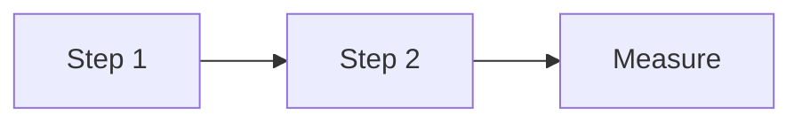

# EXP-XXX — [Short Title]

**ID:** EXP-XXX
**Date started:** YYYY-MM-DD
**System:** `water` | `energy` | `food` | `automation`
**Phase:** `0` | `1` | `2` | `3`
**Status:** `planning` | `running` | `completed` | `abandoned`

---

## Hypothesis

*Specific, falsifiable, measurable.*

---

## Setup

**Materials:**
- Item 1

**Procedure:**

1. Step 1
2. Step 2
3. Record measurement

---

## Raw data

| Date | Variable | Value | Unit | Notes |
|---|---|---|---|---|
| | | | | |

*Data files → `experiments/data/EXP-XXX/`*

---

## Analysis

---

## Conclusion

**Hypothesis held?** `yes` | `no` | `partially`

**Key finding:**

**Design impact:**

---

## Next steps

- [ ] Action 1

---

## References

-
